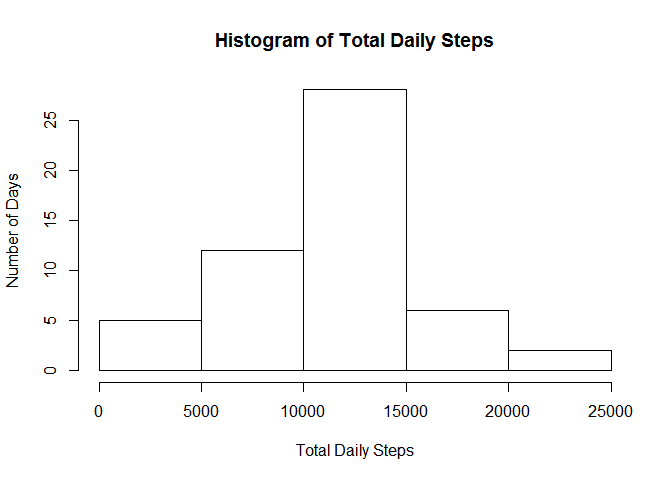
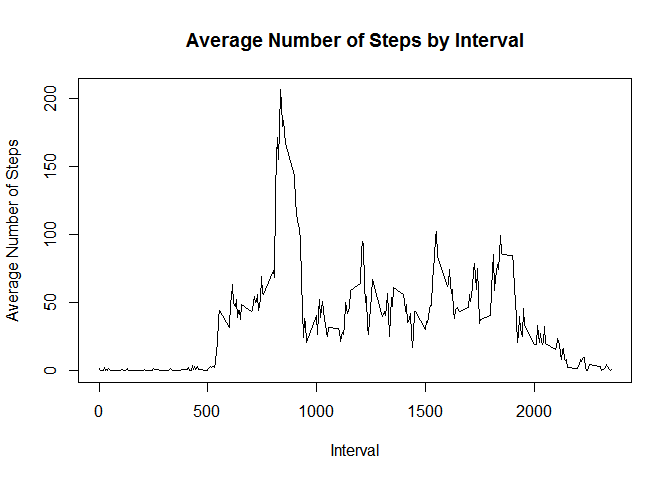
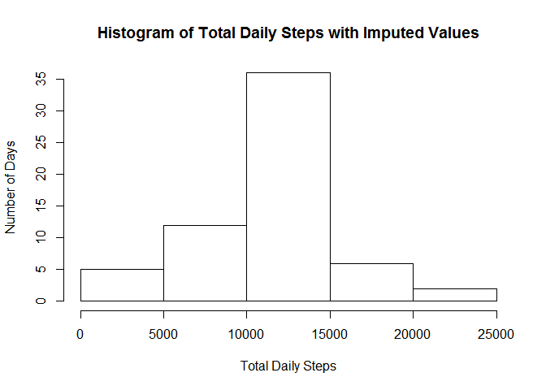
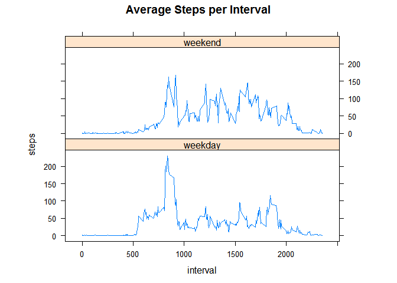

## Loading and preprocessing the data


```r
    library(dplyr)
```

```
## Warning: package 'dplyr' was built under R version 3.4.3
```

```
## 
## Attaching package: 'dplyr'
```

```
## The following objects are masked from 'package:stats':
## 
##     filter, lag
```

```
## The following objects are masked from 'package:base':
## 
##     intersect, setdiff, setequal, union
```

```r
    library (lattice)

    activity_raw <- read.csv ("activity.csv", header=TRUE)

    ## Remove rows that has NA in any column

    activity_pp <- activity_raw[!is.na(activity_raw$steps) &
                                !is.na(activity_raw$interval), ]
```


## What is the mean total number of steps taken per day?


```r
    ## Use aggregate to sum the steps by day
    daily_steps <- aggregate(steps ~ date, data = activity_pp, FUN = sum)

    ## Make a histogram of total number of steps taken per day
    hist(daily_steps$steps,
         main = "Histogram of Total Daily Steps",
         xlab = "Total Daily Steps", ylab = "Number of Days")
```

<!-- -->

```r
    ## Show the mean and median of the total number of steps taken each day
    print (paste ("Mean of total Steps   =", mean(daily_steps$steps)))
```

```
## [1] "Mean of total Steps   = 10766.1886792453"
```

```r
    print (paste ("Median of total Steps =", median(daily_steps$steps)))
```

```
## [1] "Median of total Steps = 10765"
```


## What is the average daily activity pattern?


```r
    ## Use aggregate function to total the steps for each 5 min interval over all days
    avgsteps_by_5min <- aggregate (steps ~ interval, data = activity_pp, FUN = mean)

    ## Plot (line plot) average steps against each 5 min interval
    plot(avgsteps_by_5min$interval, avgsteps_by_5min$steps, type="l",
         xlab="Interval", ylab="Average Number of Steps",
         main="Average Number of Steps by Interval")
```

<!-- -->

```r
    ## Find the interval that has the most number of steps on average across all days
    max_interval <- avgsteps_by_5min[which.max(avgsteps_by_5min$steps), 1]
    print (paste ("The interval that has the maximum number of steps is", max_interval))
```

```
## [1] "The interval that has the maximum number of steps is 835"
```


## Imputing missing values


```r
    ## Get a boolean vector of all the rows with NA steps
    na_rows <- is.na(activity_raw$steps)
    na_intervals <- data.frame(activity_raw$interval[na_rows])

    ## Give the column the name "interval" so that we can do inner_join
    ## between na_intervals and another data frame afterwards
    colnames(na_intervals) <- c("interval")

    ## Get the average steps for each interval 
    avg_steps_by_interval <- aggregate(steps ~ interval, data = activity_pp, FUN=mean)

    ## Join the tables na_intervals and avg_steps_by_interval
    missing_steps <- inner_join(na_intervals, avg_steps_by_interval)
```

```
## Joining, by = "interval"
```

```r
    ## Create a new copy of activity_raw
    activity_pp2 <- activity_raw

    ## Replace the NA values in steps with the average of that time interval
    ## across all intervals.
    activity_pp2$steps[na_rows] <- as.integer(missing_steps$steps)
```


## Are there differences in activity patterns between weekdays and weekends?


```r
    ## Use aggregate to sum the steps by day
    daily_steps <- aggregate(steps ~ date, data = activity_pp2, FUN = sum)

    ## Make a histogram of total number of steps taken per day
    hist(daily_steps$steps,
         main = "Histogram of Total Daily Steps with Imputed Values",
         xlab = "Total Daily Steps", ylab = "Number of Days")
```

<!-- -->

```r
    ## Show the mean and median of the total number of steps taken each day
    print (paste ("Mean of total Steps   =", mean(daily_steps$steps)))
```

```
## [1] "Mean of total Steps   = 10749.7704918033"
```

```r
    print (paste ("Median of total Steps =", median(daily_steps$steps)))
```

```
## [1] "Median of total Steps = 10641"
```

```r
    print ("Removing the NA values caused the mean and median to be lower.")
```

```
## [1] "Removing the NA values caused the mean and median to be lower."
```

Are there differences in activity patterns between weekdays and weekends ?


```r
    # Create the string-type dayname for each date in data frame
    activity_pp2$date    <- as.Date(activity_pp2$date)
    daynames             <- weekdays(activity_pp2$date)

    # Add new column named "weekend" to data frame with values
    # "weekend" or "weekday" 
    activity_pp2$weekend <- as.factor(ifelse ((daynames == "Saturday" |
                              daynames == "Sunday"), "weekend", "weekday"))

    # Aggregate by interval and weekend/weekday
    steps_by_interval_dow <- aggregate (steps ~ (interval + weekend),
                                        data = activity_pp2, FUN = mean)
    
    xyplot (steps ~ interval | factor(weekend), data = steps_by_interval_dow,
            aspect = 1/3, type="l", main = "Average Steps per Interval")
```

<!-- -->

```r
    print(paste("We see that weekdays have more activity in the morning,",
                 "while weekends have more overall activity throughout the day."))
```

```
## [1] "We see that weekdays have more activity in the morning, while weekends have more overall activity throughout the day."
```

